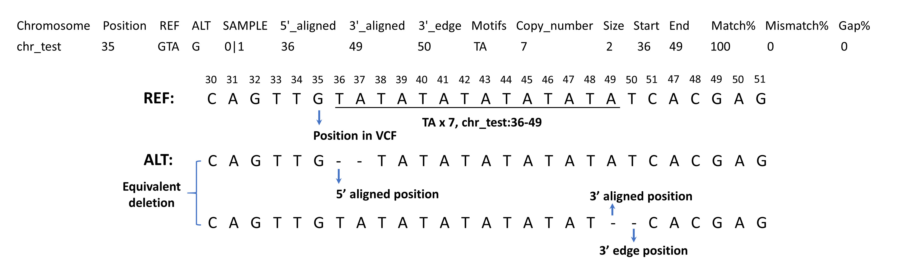

# VarSCAT: The Variants Sequence Context Annotation Tool
## Introduction
VarSCAT is an open-source, a command-line based tool written in Python for annotating variant sequence context. VarSCAT takes a VCF file as input, together with a reference sequence, to give various information about sequence context of normalized variants. **The adjacent sequence annotation module** has functions to give breakpoint ambiguous information about 5’ aligned positions, 3’ aligned positions, effected regions of variants, HGVS nomenclature, distance to 3’ direction adjacent variants, flanking bases of REF and ALT, and also able to do custom annotations with user-provided files. With a given genomic coordinates, VarSCAT could output sequences of the wildtype sequence and the mutated sequence that contain variants, as well as its complementary sequence. **The tandem repeat annotation module** can analyze sequence context around variants and annotate putative tandem repeat regions that contain variants with user defined parameters for purity, composition, and size of putative tandem repeats.<br />
<p align="center">

</p>

## Dependencies:
#### For conda:
`conda env create -f environment.yml`<br />
`conda activate VarSCAT`<br />
#### Install dependencies: 
`pip install -r requirements.txt`<br />
for pip install, bedtools and htslib should be installed manually. So we recommended install VarSCAT with conda.
#### Dependencies:
**Currently tested on CentOS 7.9 and ubuntu 20.04, Windows is not supported due to dependencies**<br />
**VarSCAT were tested with python 3.6.8 and the versions of dependencies are listed as follows**<br />
1. PyVCF3==1.0.2 (https://pypi.org/project/PyVCF3/) 
2. Biopython=1.76 (https://biopython.org/)
3. Pandas==1.1.5, lastest version on python3.6 (https://pandas.pydata.org/pandas-docs/version/1.1.5/)
4. pysam==0.18.0 (https://pysam.readthedocs.io/en/latest/index.html)
5. ordered-set==4.0.2, lastest version on python3.6 (https://pypi.org/project/ordered-set/4.0.2/)
6. pyfaidx==0.6.4, lastest version on python3.6 (https://pypi.org/project/pyfaidx/0.6.4/)
7. packaging==21.3 (This dependency is for pyfaidx to read bgzip compressed reference fasta.)
8. pybedtools==0.7.10 (http://daler.github.io/pybedtools/changes.html#changes-in-v0-7-10) 
9. bedtools==2.30.0 (https://github.com/arq5x/bedtools2/tree/v2.30.0)
10. htslib==1.9 (https://github.com/samtools/htslib/tree/1.9)<br />

## Usage:
### Notes
Because of dependency, the speed of reading bgzip reference fasta is slower than plain fasta. **The plain fasta is recommended** at the moment.<br />
The reference sequence file should be indexed with samtools (http://www.htslib.org/doc/samtools-faidx.html)<br />
The VCF file should be indexed if specific locations need to be analyzed (http://www.htslib.org/doc/tabix.html)<br />
### Examples with test files in data folder
**Output 5' align positions, 3' align positions, 3' edge positions, flanking bases of variants, HGVS nomenclature and distance to 3' variants**<br />
`python VarSCAT.py -A --LRP 1 --HGVS 1 --flank 1 --neighbor 1 --vcf ./data/test.vcf.gz --reference ./data/test.fa --output output`<br />
```
Chromosome      Position        REF     ALT     ID      SAMPLE  5'_aligned      3'_aligned      3'_edge ref_sequence    alt_sequence    HGVS    distance_3_nearest_Var(bp)
chr_test        22      G       A       .       0|1     22      22      22      CGT     CAT     chr_test:g.22G>A        3
chr_test        25      T       TA      .       0|1     25      26      26      TAT     TAAT    chr_test:g.26dup        3
chr_test        29      G       A       .       1|1     29      29      29      TGC     TAC     chr_test:g.29G>A        3
chr_test        32      G       A       .       1|1     32      32      32      AGT     AAT     chr_test:g.32G>A        4
chr_test        35      GTA     G       .       0|1     36      49      50      GTATATATATATATATC       G--TATATATATATATC       chr_test:g.37AT[6]      3
chr_test        53      C       G       .       1|1     53      53      53      ACG     AGG     chr_test:g.53C>G        3
chr_test        56      G       T       .       1|1     56      56      56      AGT     ATT     chr_test:g.56G>T        4
chr_test        59      CA      C       .       0|1     60      75      75      CAAAAAAAAAAAAAAAAG      C-AAAAAAAAAAAAAAAG      chr_test:g.75del        3
chr_test        78      T       C       .       0|1     78      78      78      GTA     GCA     chr_test:g.78T>C	
```
**Output the reference sequence, the mutated sequence and the reverse complement of mutated sequence for a specfici location**<br />
`python VarSCAT.py -A --mut_seq 1 --complement 1 --location chr_test:20-30 --vcf ./data/test.vcf.gz --reference ./data/test.fa --output output_location`<br />
```
>Ref_seq chr_test:20-30
ACGTATATTGC
>Mut_seq chr_test:20-30 SNV=2 INS=1 DEL=0
ACATATAATTAC
>Reverse_complement_Mut_seq .
GTAATTATATGT
```
**Parse variants for several locations in a bed file**<br />
`python VarSCAT.py -A --LRP 1 --HGVS 1 --flank 1 --neighbor 1 --annotation ./data/custom.bed --bed ./data/regions.bed --vcf ./data/test.vcf.gz --reference ./data/test.fa --output output_bed`<br />
```
Chromosome      Position        REF     ALT     ID      SAMPLE  5'_aligned      3'_aligned      3'_edge ref_sequence    alt_sequence    HGVS    distance_3_nearest_Var(bp)      Ann_loc Ann_info
chr_test        22      G       A       .       0|1     22      22      22      CGT     CAT     chr_test:g.22G>A        3               
chr_test        25      T       TA      .       0|1     25      26      26      TAT     TAAT    chr_test:g.26dup        3       chr_test:25-38  anno_A|anno_B
chr_test        29      G       A       .       1|1     29      29      29      TGC     TAC     chr_test:g.29G>A        24      chr_test:25-38  anno_A|anno_B
chr_test        53      C       G       .       1|1     53      53      53      ACG     AGG     chr_test:g.53C>G        3       chr_test:53-65  anno_B|anno_C
chr_test        56      G       T       .       1|1     56      56      56      AGT     ATT     chr_test:g.56G>T        4       chr_test:53-65  anno_B|anno_C
chr_test        59      CA      C       .       0|1     60      75      75      CAAAAAAAAAAAAAAAAG      C-AAAAAAAAAAAAAAAG      chr_test:g.75del                chr_test:53-65  anno_B|anno_C	
```
**Output flanking bases of variants and tandem repeat regions with default setting** <br />
`python VarSCAT.py -A --flank 1 -T --vcf ./data/test.vcf.gz --reference ./data/test.fa --output output_TR`<br />
```
Chromosome      Position        REF     ALT     ID      SAMPLE  ref_sequence    alt_sequence    Motifs  Copy_number     Size    Start   End     Repeat_Score    Alignment_Score Match%  Mismatch%       Gap%    Repeat_GC%      Copy_number_change
chr_test        22      G       A       .       0|1     CGT CAT                                                                                             
chr_test        25      T       TA      .       0|1     TAT     TAAT                                                                                            
chr_test        29      G       A       .       1|1     TGC     TAC                                                                                             
chr_test        32      G       A       .       1|1     AGT     AAT                                                                                             
chr_test        35      GTA     G       .       0|1     GTATATATATATATATC       G--TATATATATATATC       TA      7       2       36      49      7.0     14.0    100.0   0.0     0.0 0.0     -1
chr_test        53      C       G       .       1|1     ACG     AGG                                                                                             
chr_test        56      G       T       .       1|1     AGT     ATT                                                                                             
chr_test        59      CA      C       .       0|1     CAAAAAAAAAAAAAAAAG      C-AAAAAAAAAAAAAAAG      A       16      1       60      75      16.0    16.0    100.0   0.0     0.0 0.0     -1
chr_test        78      T       C       .       0|1     GTA     GCA 											
```
If two modules are used together, the commom parameters '--vcf','--reference','--location','--bed','--based' and '--output' should be only announced once. Results of two modules will be merged in one file. If no module is given, the output will be normalized variant list in txt format.<br />

### To get help page of VarSCAT: 
**Main:** `python VarSCAT.py -h`<br />
```
VarSCAT: Variant Sequence Context Annotation Tool (v1.1.0)
Help main:
-A,--Adjacent: adjacent sequence annotation module.
-T,--TR: tandem repeat annotation module.
-h,--help: help page. (-h, -A -h, -T -h)

Two modules can be used together or separate.
If two modules are used together, the commom parameters '--vcf','--reference','--location','--bed','--based' and '--output' should be only announced once. Results of two modules will be merged in one file. If no module is given, the output will be normalized variant list in txt format.
```
**Adjacent Sequence annotation module:** `python VarSCAT.py -A -h`<br />
```
Adjacent Sequence Annotation Module:
Required parameters:
--vcf: input VCF file. (The VCF file should be indexed if "--location" or "--bed" is activated, a tbi file of the VCF is required)
--reference: input reference sequencing file. (The reference sequence should be indexed, a fai file is required)
--based: 0-based or 1-based reference coordination. (default:1)
--output: prefix of output file.

Optional parameters:
--location: a genome location needs to be parsed. (format chrx:xxxx-xxxx)
--bed: a bed file contains genome locations need to be parsed.("choromosome", "start", "end" are required)
--LRP: output the 5' aligned (left-most) and 3' aligned (right most) coordinates and 3' edge positions of variants. (default=0, 0:false,1:true)
--HGVS: output the HGVS nomenclature (default=0, 0:false,1:true. Note: According to HGVS recommendation, the reference sequence can only be NCBI Reference Sequence,user should know the corresponding accession and version of the used reference)
--flank: output the flank bases of variants. (default=0, 0:false,1:true)
--neighbor: output the distance to 3' direction nearest variant. (default=0, 0:false,1:true)
--mut_seq: output the reference and mutated sequence based on variants. (default=0, 0:false,1:true. Note: valid with "--location")
--complement: output the reverse complement sequence of mutated sequence. (default=0, 0:false,1:true. Note: valid with "--mut_seq")
--annotation: annotate variants with custom files in bed format. ("choromosome", "start", "end" are required. Additional information can be provided and annotated. Multiple bed files can be used, "--annotation custom.bed,custom2.bed". Note: valid with "--location" or "--bed")

-h,--help: help page.
```
**Tandam repeat annotation module:** `python VarSCAT.py -T -h`<br />
```
Tandem Repeat Annotation Module:
Required parameters:
--vcf: input VCF file. (The VCF file should be indexed if "--location" or "--bed" is activated, a tbi file of the VCF is required)
--reference: input reference sequencing file. (The reference sequence should be indexed, a fai file is required)
--based: 0-based or 1-based reference coordination. (default:1)
--output: prefix of output file.

Optional parameters:
--location: a genome location needs to be parsed. (format chrx:xxxx-xxxx)
--bed: a bed file contains genome locations need to be parsed.(Three columns: choromosome, start, end)

Advanced parameters:
--min_unit: the minimun size of tandem repeat motifs. (default=1)
--max_unit: the maximum size of tandem repeat motifs. (default=6, larger size will increase the running time)
--min_time: the minimun copy number to call a tandem repeat region. (default=4) 
--match: the match score for motifs aligned with a potential tandem repeat region. (default=1)
--mismatch: the mismatch score for motifs aligned with a potential tandem repeat region. (default=-1)
--gap: the gap penalty for for motifs aligned with a potential tandem repeat region. (default=-2)
--similarity: the minimum similarity between potential repeat units. (default=100, means 100% similarity)
--gap_tolerate: the maximum tolerated gap size (bp) between potential repeat units. (default=0, set -1 for maximum gap of motif size)
--min_score: the minimum alignment sum score for a tandem repeat region. (default=10, set according "--match","--mismatch","--gap")
--min_match_per: the minimum match percentage for a tandem repeat region. (default=100, means 100% of matches)

-h,--help: help page.
```
